# 📈 SimInvest Platform

A comprehensive full-stack investment simulation and portfolio management system built with Spring Boot and React.js. SimInvest provides users with real-time market data, portfolio tracking, educational resources, and a complete trading simulation experience.

## 🚀 Tech Stack

### Backend
- **Java + Spring Boot** (IntelliJ IDEA as IDE)
- **PostgreSQL** database with pgAdmin4
- **Spring Security + JWT** for authentication & authorization
- **Finnhub API** for real-time market data
- **NewsAPI** for market news integration
- **BCrypt** for password encryption
- **Postman/Insomnia** for API testing
- **Git + GitHub** for version control

### Frontend
- **React.js + JavaScript** (VS Code as IDE)
- **Tailwind CSS** for responsive UI design
- **Responsive design** with mobile-first approach
- **Modern component architecture**

## 🔐 Security Features

- **JWT-based authentication** with secure token management
- **Role-based access control** (Admin/User roles)
- **Password encryption** using BCrypt hashing
- **Protected endpoints** with proper authorization
- **Session management** with secure logout functionality

## ✨ Key Features

### 🏢 Market Data & External Integration
- **Real-time stock data** via Finnhub API integration
- **Auto-creation** of securities with company information
- **Historical price data** with custom date range queries
- **Automated market data updates** (every 15 minutes during trading hours)
- **Extended hours trading** support with after-market updates
- **Data quality monitoring** with validation and recovery systems
- **Circuit breaker pattern** for API reliability

### 👤 User Management
- **Secure user registration** with email validation
- **JWT authentication** system
- **Admin auto-creation** on application startup
- **Role-based access control** preventing cross-user data access
- **Password matching validation**
- **Unique email enforcement**

### 💼 Portfolio & Position Management
- **Real-time portfolio valuation** with current market prices
- **Automatic average cost calculations** for position tracking
- **Realized and unrealized gain/loss** calculations
- **Position performance analytics** with holding periods
- **Portfolio weight calculations** and day change tracking
- **Annualized returns** and break-even price analysis
- **Attention management** for significant position changes

### 📊 Order & Transaction Management
- **Real-time order execution** with market/limit order types
- **Automated transaction creation** with audit trail
- **Fee system** (0.5% rate, $1-$50 range)
- **T+2 settlement processing** with automated scheduling
- **Order validation** for funds and share availability
- **Transaction status tracking** and settlement monitoring
- **Backup processing** for missed settlements

### 📰 Market News Integration
- **Real-time news fetching** from NewsAPI
- **Category-based filtering** (8 business categories)
- **Search functionality** across titles and descriptions
- **Responsive grid layout** (1-3 columns)
- **Trusted source prioritization** (Bloomberg, Reuters, WSJ, CNBC)
- **External link handling** with new tab opening

### 👀 Watchlist Management
- **Multiple watchlists** per user
- **Real-time security information** (symbol, name, current price)
- **Authenticated access** with user-specific data
- **Watchlist clearing** functionality
- **Custom names and descriptions**

### 📚 Educational Resources
- **Admin-managed content** creation system
- **Multiple content categories**: Investment basics, capital markets, strategies, behavioral finance, risk management, portfolio management, market trends, financial analysis
- **Diverse content types**: Videos, podcasts, articles, blog posts, courses
- **Difficulty levels**: Beginner to Expert progression
- **Structured learning paths**

## 📱 User Interface Pages

- **🔐 Login/Register Pages** - Secure authentication interface
- **📊 Dashboard** - Portfolio overview and key metrics
- **👤 User Profile** - Account management and settings  
- **📈 Trading Page** - Order placement and execution
- **💰 Portfolio Page** - Detailed position tracking and analytics
- **📰 News Page** - Real-time market news and updates
- **📈 Market Page** - Securities browsing and market data
- **👀 Watchlist Page** - Custom security monitoring
- **📚 Educational Content** - Learning resources and materials

## 🔄 Automated Systems

### Market Data Scheduler
- **Real-time updates**: Every 15 minutes during trading hours (9:30 AM - 5:00 PM EST)
- **Daily data collection**: 5:00 PM EST after market close
- **Weekly historical updates**: Sundays at 2:00 AM EST (30-day historical data)
- **Extended hours support**: Every 30 minutes (4:00 PM - 8:00 PM EST)
- **Pre-market validation**: 8:00 AM EST before market open
- **Data quality monitoring**: 6:00 AM EST daily checks
- **Recovery operations**: 4:30 PM EST on trading days
- **Weekly cleanup**: Sundays at 3:00 AM EST (removes data >2 years old)

### Performance Features
- **Circuit breaker pattern** for API failure protection
- **Batch processing** (configurable, default: 50 securities)
- **Multi-threaded execution** (configurable thread pool, default: 5 threads)
- **Rate limiting** with configurable delays (default: 100ms)
- **Timeout protection** (30-second timeout per batch)
- **Graceful error handling** with automatic retry logic

## 🎯 Core Functionalities

✅ **User Registration & Secure Login**  
✅ **Real-time Portfolio Management**  
✅ **Live Market Data Integration**  
✅ **Order Execution & Settlement**  
✅ **Watchlist Management**  
✅ **Market News Integration**  
✅ **Educational Content System**  
✅ **Performance Analytics**  
✅ **Mobile-Responsive Design**  
✅ **Automated Data Updates**  
✅ **Risk Management Tools**  
✅ **Transaction Audit Trail**  

## 🛠️ Development Tools

- **Git & GitHub** → Version control & collaboration
- **IntelliJ IDEA** (backend) & **VS Code** (frontend) → Development environments  
- **Postman/Insomnia** → API testing and documentation
- **pgAdmin4** → Database management and monitoring
- **Finnhub API** → Real-time market data provider
- **NewsAPI** → Market news integration

## 💡 Project Highlights

This project demonstrates comprehensive full-stack development skills with:

- **Advanced Spring Boot** backend architecture with scheduled tasks
- **Real-time data integration** from multiple external APIs  
- **Complex financial calculations** and portfolio analytics
- **Robust security implementation** with JWT and role-based access
- **Responsive React.js frontend** with modern UI/UX design
- **Automated system monitoring** and data quality assurance
- **Professional-grade error handling** and recovery mechanisms

SimInvest is designed for investors, students, and financial enthusiasts to practice investment strategies, track portfolio performance, and learn about financial markets in a risk-free simulation environment.

---

## 📸 Screenshots

### Login Page
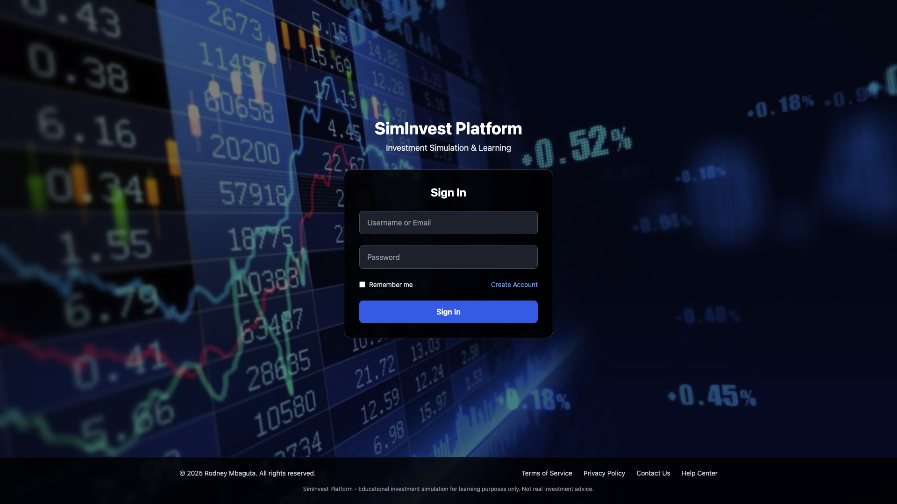

### Register Page  

### Dashboard  
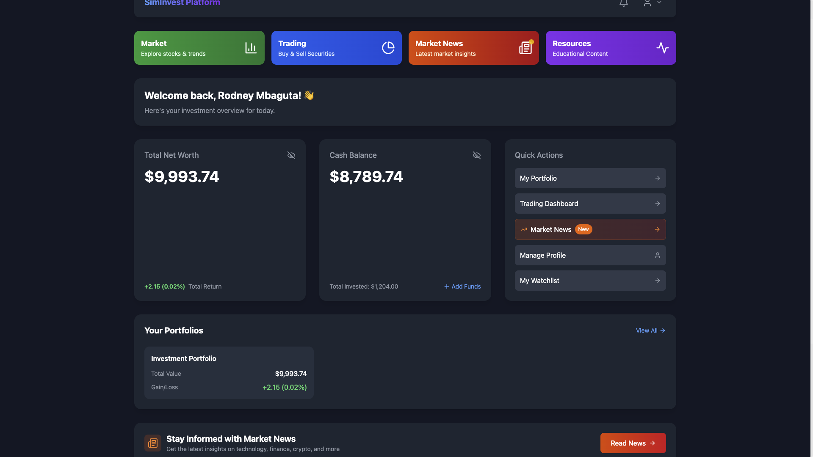

### Trading Page
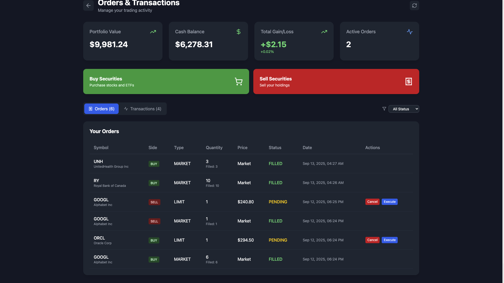
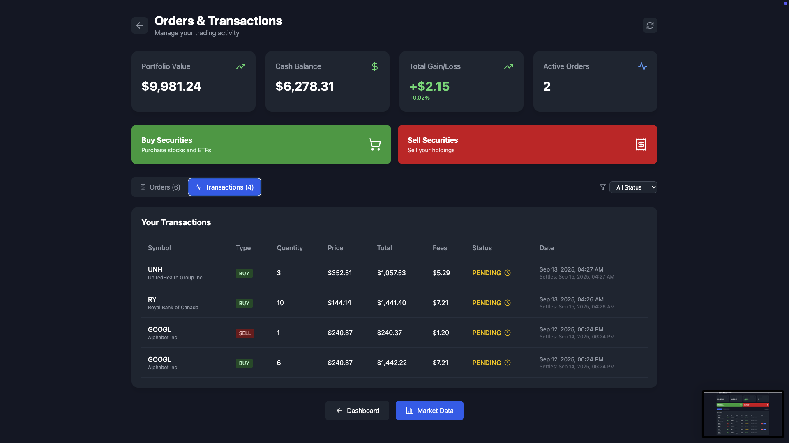

### Portfolio Management
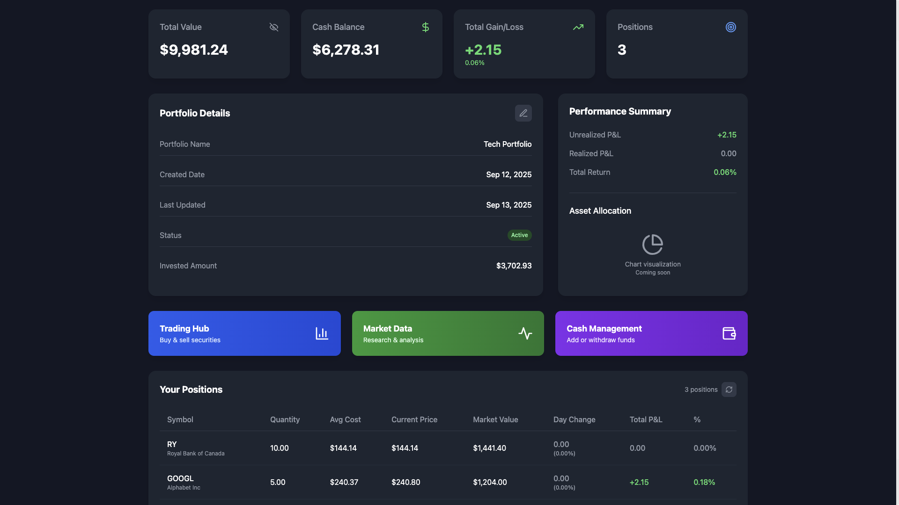

### Market Page
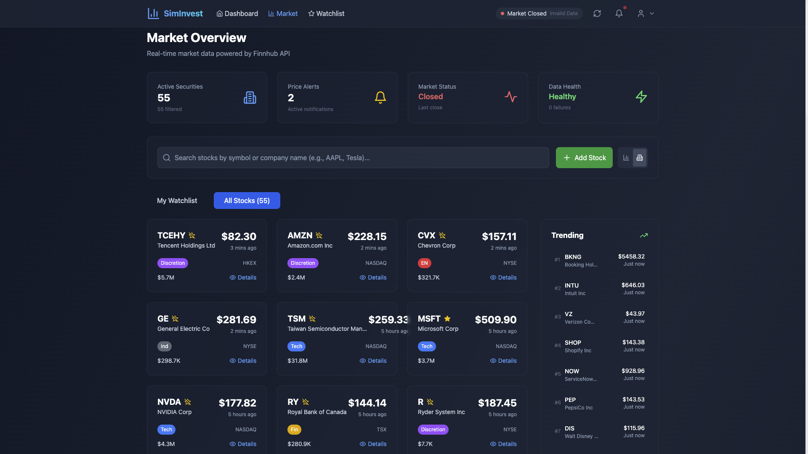
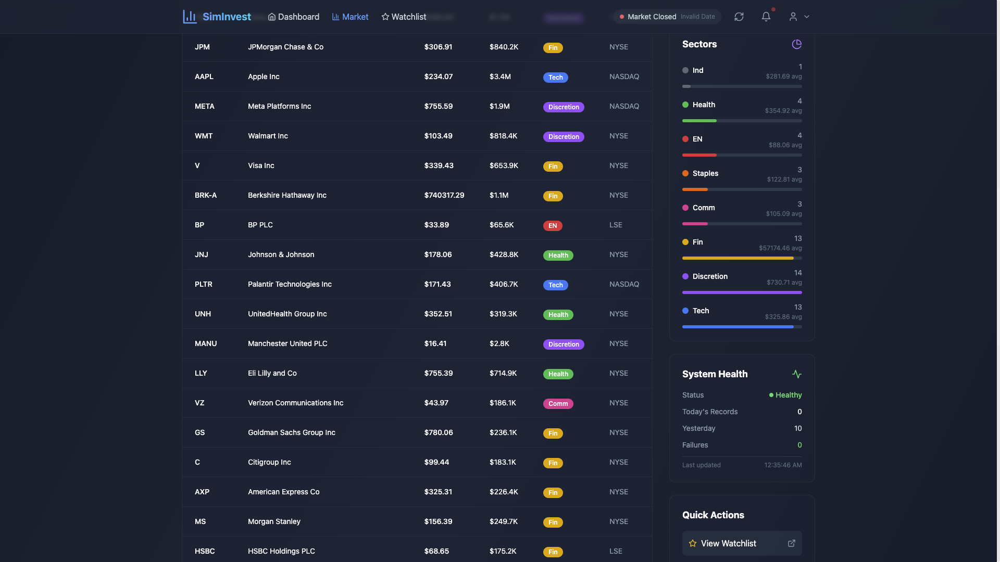
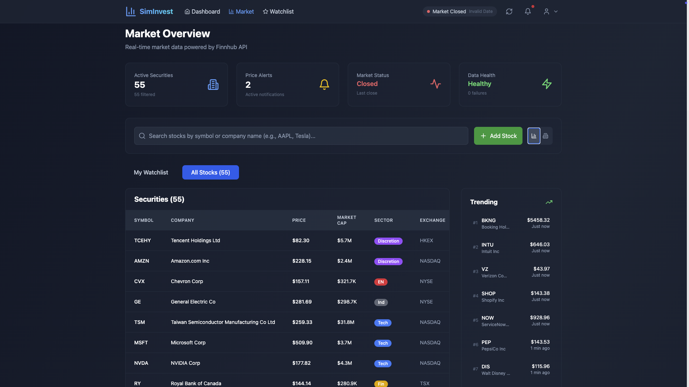

### Market News

### Watchlist
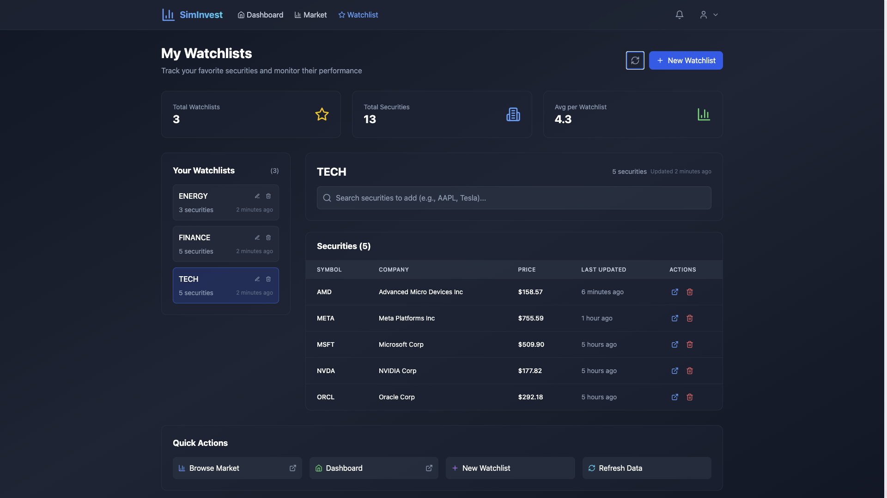
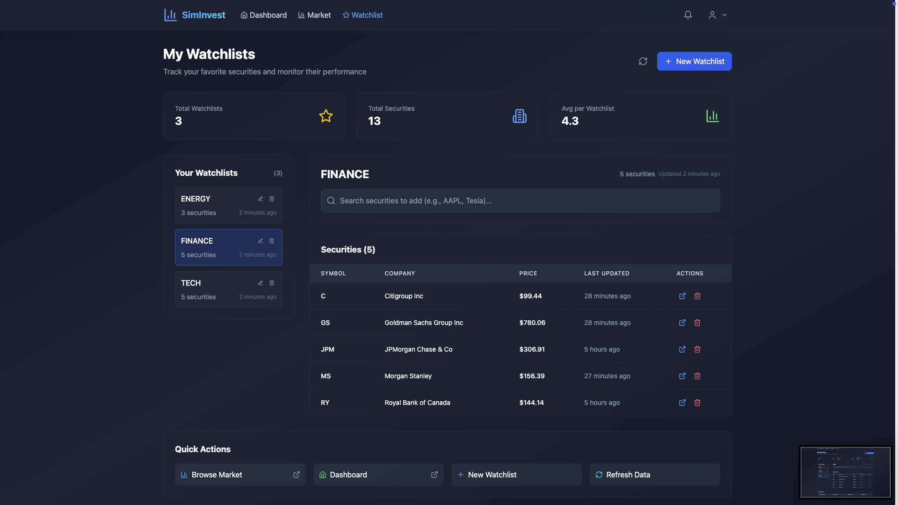

### Educational Resources
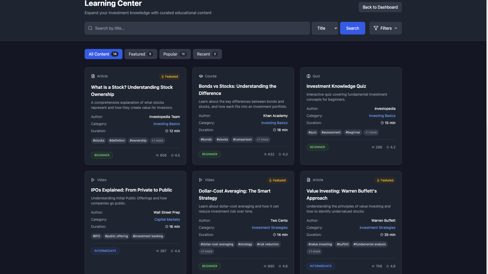

---

**Built with ❤️ using Spring Boot & React.js**
